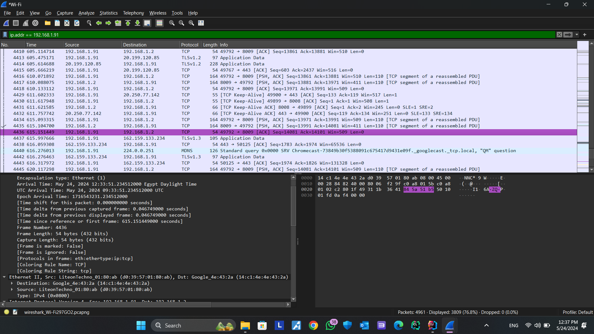

# Server-Client-Chat-Application

## Overview
**Server-Client-Chat-Application** is a Java-based application designed to facilitate communication between a server and multiple clients. This repository contains the source code and resources required to run the chat application.

## Table of Contents
1. [Introduction](#introduction)
2. [Getting Started](#getting-started)
3. [Project Structure](#project-structure)
4. [Images](#images)
5. [Contributing](#contributing)
6. [License](#license)

## Introduction
The Server-Client-Chat-Application allows multiple clients to connect to a server and exchange messages in real-time. The application also includes features for monitoring network traffic using Wireshark to analyze the communication between the server and clients.

## Getting Started
To get started with the Server-Client-Chat-Application, follow these steps:

1. **Clone the Repository**
   ```sh
   git clone https://github.com/MostafaAhmed556/Server-Client-Chat-Application.git
   ```

2. **Navigate to the Project Directory**
   ```sh
   cd Server-Client-Chat-Application
   ```

3. **Build and Run the Application**
   - The application can be built and run using an IDE that supports Java (e.g., IntelliJ IDEA, Eclipse).

## Project Structure
The project structure is organized as follows:

- `src/`: Contains the source code for the application.
- `images/`: Includes image files such as screenshots and Wireshark packet traces.
- `.idea/`: Contains project-specific settings and configurations.
- `LICENSE`: The license file for the project.
- `README.md`: The main documentation file for the project.
  
## Images
<details>
<summary>Wireshark Packet Tracing Configurations</summary>


</details>

<details>
<summary>Source and Destination Address</summary>


</details>

<details>
<summary>Full Packet Content</summary>



</details>

<details>
<summary>Chat Between Client and Server</summary>


</details>

<details>
<summary>Server Thread Ready State</summary>


</details>

## Contributing
Currently, there are no specific contributing guidelines available for this repository. If you wish to contribute, please fork the repository, make your changes, and submit a pull request.

## License
This project is licensed under the MIT License. For more details, refer to the `LICENSE` file in the repository.

## Special Thanks
Special thanks to the following contributor(s) for their efforts and contributions to the project:
- [Ziad Hamdy](https://github.com/ZiadHamdyMohamed)
